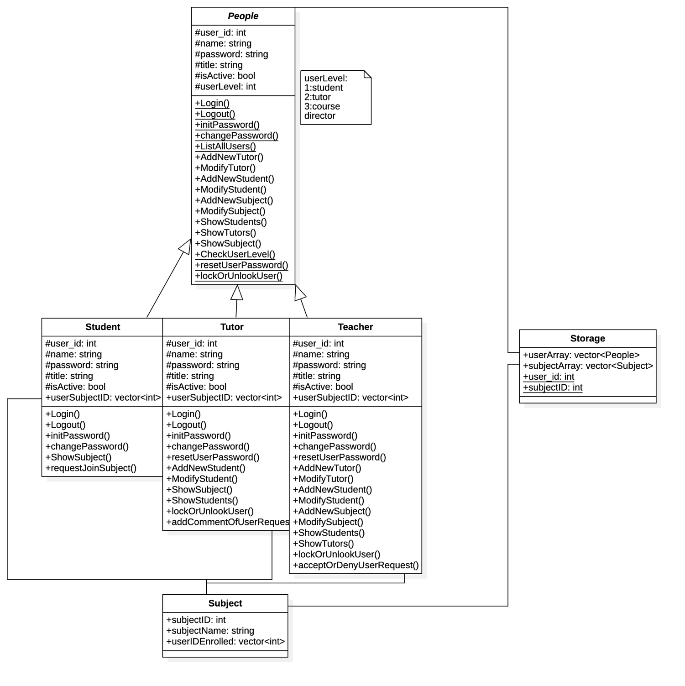
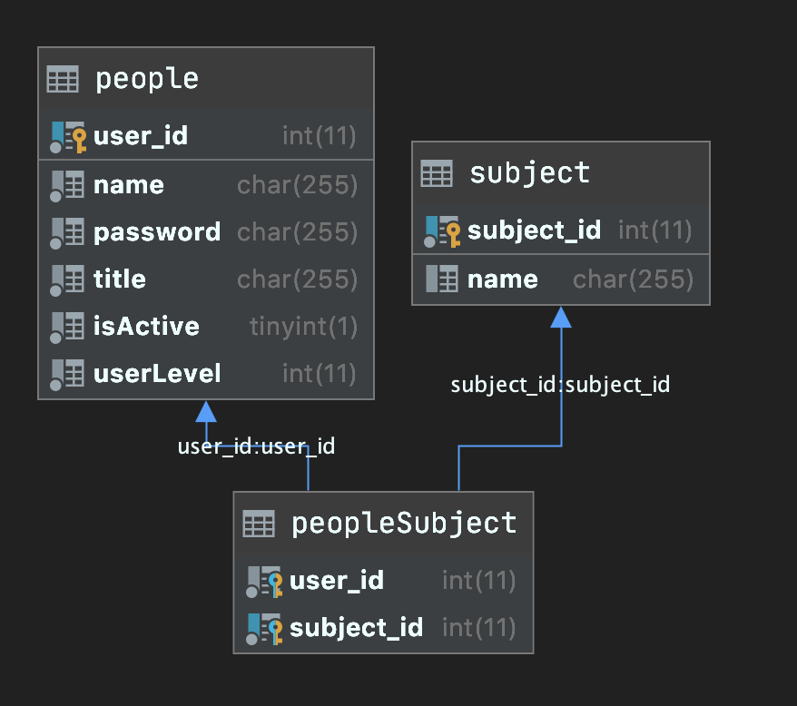

# OOP Major Practical Design - Student management system C++


---


# Project Specification - Major Practical Introduction

> Our project implements a student information management system. This system contains four classes: Student, Tutor and Teacher and one abstract class: Person. The system allows users to access different information according to their authority. For example, the students can only request to reset the password, but they are not able to reset the password themselves, they need to contact a higher authority, i.e. tutor or teacher to help them to reset the password. In order to build this system, the data such as people’ name, subjects' ID will be stored in the array, string and objects. In addition, Inheritance and Polymorphism can be used to avoid the repeat codes, because those three classes have a lot of common functionalities. Lastly, the whole program will be exhaustively tested by in order to ensure that there’s no bug in our system.
> 

## **Try it out by [docker](https://hub.docker.com/r/akide/oop-project):**

```bash
docker run --rm -it akide/oop-project:latest
```
## Build status：

| **master**      | [](https://app.travis-ci.com/github/UAws/OOP-Project) |
| --------------- | ------------------------------------------------------------ |
| **development** | [](https://app.travis-ci.com/github/UAws/OOP-Project) |

## Code coverage: [](https://codecov.io/gh/UAws/OOP-Project)

# Design Description

## Assessment Concepts

> Memory allocation from stack and the heap
> 
- **Arrays:** We will use serial dynamic arrays using new to add in some initial people and subject entries and allow more people and subjects to be constructed.
- **Strings:** Strings are extensively crossing over the entire project, such as, names, attributes, properties.
- **Objects:** Briefly – Student, Tutor, Teacher (based on people), subject and storage.

> User Input and Output
> 
- **I/O of different data types:**
- Command-line. Interactive actions have been presented, such as login requires user id, name input. Notifications displays on the console.
- Specifically, the system requires user input integers to make selection from the menu.
- String inputs are required when user wish to modify the data.

## Object-oriented programming and design

- **Inheritance:** There are different user level as known as different permissions which allow people make proper action refers their authorities. Such as, Students can show different subjects and the subject they enrolled, tutors are able to show more information then students do and teachers have the over-control permissions,e.g. reset user’s password, approve students’ request.
- **Polymorphism:** Students, tutors, teachers are the sub-classes of people class, they are overridden and extended the functionality of the base class, such as all of sub-class have a fixture call person enrolment onboard, student class implements to join subjects, tutor can preview student request and add comments to provide more useful information to teacher, finally teachers make final decisions based on students’ requests and tutors' comments.
- **Abstract Classes:** Based on the goal and reality of the student's information management system, every different role has their specific functionality and fixtures need to be implement properly. These differences are purely isolate to base classes which are the abstract classes, interfaces.

**Class Diagram**



R**elational Database Diagram** 

 



> Class Description
> 

**People**

This is the abstract base class which covers common characteristics of the other classes. For example: login/out; change password; change name; view all stuffs and students; etc.

**Student**

The class Student simulates students with their corresponding ‘functions’. When a student first logs in, it is required to initialize their password and enrol their courses.

Suppose that the student has entered wrong password for more than 3 times, the student account would be freeze.

Successfully logged: information of the student would be shown (information that has been stored in Storage), such as user ID, subject ID and its enrolment status. Then the system would ask the student if he/ she needs to make any change, i.e. sets up a new password / enrol any new subject.

**Tutor**

This class covers characteristics of a tutor. When a tutor first logs in, he/ she is automatically enrolled in every course.

Suppose that the tutor has entered wrong password for more than 3 times, the tutor account would be freeze.

Successfully logged: information of the tutor would be shown (information that has been stored in Storage), such as user ID, all student information etc. Then the system would ask the tutor if he/ she needs to make any change, i.e. re-initialize a student’s password, sets up a new password etc.

**Teacher**

This class implements the ‘leader’ of the management system. When a teacher first logs in, he/ she is automatically enrolled in every course.

Suppose that the teacher has entered wrong password for more than 3 times, the password would be reset to the default password. (i.e. 123456)

Successfully logged: information of the teacher would be shown (information that has been stored in Storage), such as user ID, all student tutor information etc. Then the system would ask the teacher if he/ she needs to make any change, i.e. re-initialize a student/tutor’s password, sets up a new password etc.

> User Interface Users are presented with a list of options to choose from command-line. For example, they can choose to login or exit the system by simply input 1 or 2.More option menus would be shown in this way as well, user can then select the option they prefer by input the corresponding number.Code Style All code in the program will be properly indented using proper space tabs. Classes will begin with a capital letter. Class files (.h and .cpp) will be explicitly listed.Function Comments will be given for each function that describes what the function does, what the return type represent and what any arguments are available for the function. Code Comments will be used to describe what each block of code performs if it is not obvious from just reading the code or the code is short. Comments will be written as the code is written.
> 


# Testing Plan

> All our tests will run through our makefile each time we compile our code, automatically. We have already done 40 tests and more tests would be provided this week; we would try to achieve 100% coverage of testing of our code.
> 

## **Unit Testing**

Our unit tests will cover all public functions in our classes. Each class will have a corresponding test file like ClassNameTest.cpp, which will include a main method that will exhaustively test each function with a set of inputs and test it matches an expected output. We applied Google test, which is an automated testing tool as our debug technique, and the challenge we are dealing with is: testing for user input. Also, we will always keep up with the regression testing every time we make a change to our code.

## Code Coverage

](https://codecov.io/gh/UAws/OOP-Project/branch/master/graph/badge.svg?token=ON3OHRSFKF)

[https://codecov.io/gh/UAws/OOP-Project](https://codecov.io/gh/UAws/OOP-Project)


## Main function Test

### case one:

1. Start program , enter 2 —> show info 
2. Go back to welcome menu , enter 1 —> login 
3. Pickup user id  —> 3 and name —> teacher to login 
4. Reset teacher's password by the system default password '-1', then teacher's password to 123
5. teacher's menu will be shown , enter 1 —>Show all students
6. enter 2 —> Show all tutors
7. enter 3 —> Show all subjects
8. enter 4 —> Show all subjects enrolled by ID
    1. enter ID 3 —> select teacher01
9. enter 5 —> Change user's name
    1. enter ID 1 —> select student01
    2. enter new name —> student01-changed
10.   enter 6 —> Add new student
    1. give the name 'student-02'
    2. go back to teacher's menu then enter 1 to show all students to confirm that previous change effected 
11. enter 7 —> Add new tutor
    1. give the name 'tutor-test-01'
    2. go back to teacher's menu then enter 4 to then select previously created new user id 
    3. check that tutor automatically enrolled into all subjects 
12.  enter 8 —> Add new subject
    1. give name 'oop-02'
13.  enter 9 —> unlock user by ID
    1. give ID '1' to unlock locked user 
14. enter 10 —> exit teacher's menu 
15. enter 3 —> exit the system

Raw test file : [https://raw.githubusercontent.com/UAws/OOP-Project/master/test/input_tests/main_input_case-01/input.txt](https://raw.githubusercontent.com/UAws/OOP-Project/master/test/input_tests/main_input_case-01/input.txt)

# Schedule Plan

## Stretch Goals

> Our basic goal is to complete this set of features:
> 
1. Login/logout
2. Reset/initialize/change password
3. Add/ modify/ the tutors/students and subjects
4. Show all users/tutor/student
5. Lock or unlock user
6. Accept or deny user request
   
    If we finished and tested the above functionalities then we will begin expanding our program to include:
    
7. Add/modify/check/delete announcements
8. Submit homework system.
9. Communicate with teacher.
10. Test the input/output.
11. Connect database.
12. Use google test to test all the functions.
13. Replace all the array by map & vector.

**Week 8**

- Determinate the co-code method.
- Develop project plan and upload to svn.
- Set up the coding Environment.
- Assign work with group number

**Week 9**

- First makefile demo
- Do more study on the input-testing.

> Week 10
> 
- Progress check out list:
    - Header file.
    - Class: person, student, tutor and teacher.
    - Inheritance
        - Inherit some functions from parent class person to the other three subclasses.
    - Polymorphism
        - Override some functions by their authority of each class.
    - Basic goals check list (mentioned in stretch goals).
    - Main function.
        - A simple user interface. Note: only to see whether the system works or not.
    - Makefile compile
    - Test all the functions
        - Test Inputs / Expected Outputs
        - Automated Testing
        - Regression Testing
- Limit the input. ()
    - System should only accept the specific input. (if integer required, then string will not be accepted)
- Use Google Test for a more comprehensive test. (Chi, Andrew, Akide)
- Use purely virtual to override the function according to the requirement. (Akide)
- Bring everyone's work together and debugging. (Chi, Andrew, Akide)
- Self–check with the rubric.

By the end of week 10, if above basic goals have been achieved, we then consider adding the following additional features.

> 🤔Week 11
> 
- [ ]  Evaluate the stretch goals and add some additional features. (**Chi, Andrew, Akide**)
    - [x]  communication features
        - [x]  student request to join subject
        - [x]  tutor can see the request and give the advice to teacher
        - [x]  teacher can check tutor's advice and to examine and approve students' request
    - [ ]  Grade system
        - [ ]  A simple sequencing.
        - [ ]  Mean.
        - [ ]  Return Highest & lowest score.
- [x]  Connect to the database (**Akide**)
    - [x]  Write a specific class to access/read/add/delete the database.
- [ ]  Beautify the user interface. (**Andrew**)
    - [ ]  Easy to read & manipulate.
    - [ ]  Text-based interaction
- [ ]  Self-check with the rubric(**Chi**)

# R**ubric self-check**

## CONCEPT:

1. **Originality and complexity of selected problem**
    1. Good topic and/or difficult to solve. Design requires multiple examples of most of the assessment criteria
    
    In this project, we have almost achieved the basic functions of the student information management system and this program covered all the concepts that required in this project. Also, this project is also challenaging for us, because we are using database to storage the information rather that arrays.
    
2. **Specification**
   
    1. The program works and meets all of the specifications
    
    Memory allocation from the **stack** and the **heap**
    
    - [x]  Arrays
    
    We have used a lot of vectors which are stored, The variable name itself is a stack object, but the space allocated by the allocator is in the heap.
    
    - [x]  Strings
    
    use to storage the name of each user and use in large ranges of record 
    
    - [x]  Objects
    
    See our main function & PeopleServices function
    
    2. User Input and Output
    
    - [x]  I/O of different data types
    
    ie. In the main function we have a lot of text-based Input and Output.
    
    3. Object-oriented programming and design
    
    - [x]  Inheritance
    
    Parent class: People
    
    Child class: student, teacher, tutor.
    
    - [x]  Polymorphism
    
    i.e Peopleserivce class and other service classes
    
    - [x]  Abstract Classes
    
    i.e PeopleCommunications class
    
    4. Testing
    
    - [x]  Test Inputs / Expected Outputs
    
    Check out our input test: initpassword & main_input_case-01
    
    - [x]  Automated Testing
    
    Google test has been applied in this project, check out our test folder.
    
    - [x]  Regression Testing
    
    When a new function is added, we will conduct a global test to ensure that the entire program is error-free(contusions integration).
    
    link : [https://travis-ci.com/github/UAws/OOP-Project](https://travis-ci.com/github/UAws/OOP-Project)
    
3. **Readability**
    1. The code is exceptionally well organized and very easy to follow(done)
    
    General c++ syntax without using any hight complexity syntax.
    
    All functions, unclear part and the function's working principle has been described clearly in the common"//"
    
    Moreover, we have divided our peogram into three parts: the people(abstract class), peopledao (manipulates the database), peopleService(Call in the main function) to implement that each class only realizes their unique functions and improves readability.
    
    Additionally, We use more explicit variable names to avoid logical problems caused by ambiguous variable names
    
4. **Efficiency**
    1. The code is extremely efficient without sacrificing readability and understanding. Algorithms are close to optimal as well as memory use with use of pointers for referencing objects.(not sure)(partial done)
    
    We did not abbreviate the variable names or use unclear variable names, all variable names are readable and clear, The program is highly modular, and each module performs its own functions, which ensures that the program is easy to maintain and upgrade in the future. On the other hand, in order to avoid the confusion caused by storing information in multiple arrays we use a more challenging database to store all the information, although this is challenage but this would aovid the messes. For the alforithms, some time use  vector pointer to call the function and access the information to esure the efficient operation of the program, and all vectors are freed in time.
    
5. **Use of the concept “Memory allocation from the stack and the heap”**(done)
    1. Outstanding application and realisation of the concept. Can demonstrate appropriate use of both a stack allocation and a heap allocation throughout program
    
    There are many vectors has been used and the elements are storage on the heap. Static variables stored on the static code segment , allowing global access. we also intiet some variable on the stack as peremeter. In addition, many vector pointers has been created to storage the informantion extracted form database. For example our "show/teacher/student/tutor" functions all include the use of pointer vectors. VariadicTable(storage on the stack) has also been used to sotreage the more complex data types. This is reflected in many functions (eg. Listallusers)
    
6. **Use of the concept “User Input and Output”**(done)
    1. User input/output is intuitive and C++ IO is used (cout/cin)
    
    for the interactive.
    
    The program allows user input and output, such as entering the password to access the system(cin). Also, the text-based interaction provides the output(cout). In our main function, each function We cover almost all functions with detailed explanations and guidelines(output). In order to improve the usability of the program, we used a simpler interactive method, that is using Arabic numerals to represent the execution commands of each function.(output). Also we have restricted the user’s input to ensure that The system can only receive digital commands
    
7. **Use of the concept “Object-oriented programming and design”**(done partial)
    1. Objects demonstrate understanding of previous PLUS: implementation of virtual methods in abstract
    
    This program has used the interfaces, inheritance, polymorphism, and other concept of Object-oriented programming and design,
    
    For the implementation, this program is loose coupling. The functions of all classes are separated, and each function is not highly dependent with one another, which is easy to fix bugs and add more feature later. 
    
    inheritance: many examples in child classes
    
    state: many examples in our head file.
    
    Polymorphism: peopleSerive function
    
    Virtual methods in abstract: see the child class of peopleCommnunications, it's an abstract class with only purly virtual functions
    
8. **Use of the concept “Testing”**(undone boundary test)
    1. The program has been exhaustively tested covering unit testing and boundary tests. Testing harness is written in a way that makes coverage clear (organised by class)
    
    We have done 39 tests in this project by googletest (unit test), which cover all the functions (peopleDao, people, people services )in the parent classes. (child classes are just Inherited)and Google Test is also applied for more comprehensive testing. Input tests are used for the mimic user's input, to ensure that the program does not reveived the wrong format of the command and the program print out the information correctly. check out our input test folder.
    
    we have included the boundary test in the result test.text, we have also test that when the user enters the wrong command a certain number of times, the program will be locked
    
    We also applied the contusions integration to help test the code. The tool we used is called "travis-ci", it help us to maintain the consistency of our code, this tool woud perform two global tests before merge to the master branch to make sure that the code is compiled and with no errors.
    

# **Dependence credits :**

- [Google Test](https://github.com/google/googletest)
    - unit test framework
- [prettyprint.hpp](https://github.com/louisdx/cxx-prettyprint)
    - c++ STL cout print
- [VariadicTable.h](https://github.com/friedmud/variadic_table)
    - beautiful console table print
- [Sqlpp11](https://github.com/rbock/sqlpp11)
    - A type safe SQL template library for C++
- [vcpkg](https://github.com/microsoft/vcpkg) (build sqlpp11-mysql-connector)
    - C++ Library Manager for Windows, Linux, and MacOS
- [Conan](https://github.com/conan-io/conan) (build other dependencies)
    - Conan - The open-source C/C++ package manager
    - R**ubric self-check**
